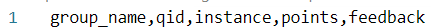

# Manual Grading Autocompiler

James Yuming Yu, 2021

github: jbrightuniverse

This is a Python utility for converting general manual grading data from PrairieLearn into CSV files that TAs can use to grade and directly upload to PrairieLearn.

It is recommended to use this utility on a course account through department servers as this ensures security of student data and provides a central location for TAs to access grading files.

## Step 1: Insert Python script into remote server

Copy `autocompile.py` into the server under the folder `YEAR/grading`. This should look something like:

Inside the script, at about line 20, is a line of code containing the name of the course on PrairieLearn. Whenever starting over in a new term, change this line to have the new course name (e.g. CPSC_213_2021W2).

## Step 2: Create a folder for the assignment of the form "AX"

Long-term, your folder structure should look like this. Assignment folders must use this exact formatting with a capital A followed by the assignment number.

## Step 3: Insert a JSON rubric into the assignment folder

This rubric should be located on the department GitHub repository.

## Step 4: Decide whether you need to grade all submissions or just ones with manual grading

For example, if your assignment uses autograders, you only need manual grading, and so you don't need to change anything.

However, if your assignment has autograders that only check for compilation and do not check for correctness (e.g. CPSC 213 A9), you need to regrade all submissions. In that case, open `autocompile.py` and set the following flag to `True` (by default it should be `False`):

## Step 5: Collect the right CSV file to grade from

On PrairieLearn, click on the assignment you want to grade, and then click downloads at the top of the screen:

IF YOU ARE ONLY GRADING SUBMISSIONS THAT NEED MANUAL GRADING (e.g. not 213 A9):

then download `submissions_for_manual_grading.csv` and put it in the assignment folder you put the rubric in.

OTHERWISE, IF YOU NEED TO REGRADE ALL SUBMISSIONS OF THE ASSIGNMENT (e.g. 213 A9):

then download `final_submissions.csv` and put it in the assignment folder you put the rubric in.

## Step 6: Collect the right set of files

Still on the downloads page, if you are ONLY GRADING SUBMISSIONS THAT NEED MANUAL GRADING (e.g. not A9), download `files_for_manual_grading.zip`, open it, and move the folder inside (it should say `AssignmentX` where X is the assignment) to the same location in the remote server where the rubric and CSV are.

IF OTHERWISE YOU ARE REGRADING ALL SUBMISSIONS (e.g. A9), download `final_files.zip`, open it, and move the folder inside to the same location in the remote server where the rubric and CSV are.

If using the first option (not A9), your folder structure under the assignment folder should now look similar to this:

If using the second option (A9), the only difference is `AssignmentX` comes from the `final_files` zip file, and the CSV file at the bottom should be `final_submissons.csv`.

Notice that `autocompile.py` is not inside the `AX` folder here: as in Step 2, it should be ONE LEVEL OUTSIDE THE `AX` FOLDERS.

## Step 7: Run the script in the terminal

`cd` to the top-level directory containing `autocompile.py`. This should be the `grading` folder following conventions above.

Inside that folder, run `python3 autocompile.py X` where you replace `X` with the assignment number. For example, if you want to grade A10, type `python3 autocompile.py 10`.

The program will then compile necessary data.

## Step 8: Open the resulting folder and grade

For example, after running A10, you might get this:

There is a separate folder for each subgroup of questions (e.g. if questions from the A10 and A11 bank were used to build A10). Inside each question subfolder is the list of students or groups, within which are relevant files. At the bottom of each folder will be two files, which may look like:

The first one is a TXT file containing a concatenated list of every submission made by a student or group for that question. This can make manual grading faster by not having to open each individual folder; if you want to view source files, you can still do so by opening the student-specific folder inside each question folder.

The second one is a CSV file containing the actual grade entry points. The list of keys at the top might look like:

Under the `points` column is an empty cell in front of each groupname/student. This is where you would enter the number of points the student would be graded for each question. If you want to grade in percentages instead, you can change the column name to `score_perc` and then enter percents as a whole number (e.g. to enter 100%, type 100).

On the right hand side of each row is a bit of HTML text representing the rubric for the question. To add your own feedback to the rubric, simply continue typing at the end of the existing text. **DO NOT DELETE THE EXISTING TEXT**, as rubrics are not auto-generated without them. Writing text after will work. If you wish to add a newline, note that this is an HTML entry field, so use ` ` to make a line break.

## Step 9: Upload back to PrairieLearn

When you are finished grading, you can directly download the CSV file you were grading on and upload it to PrairieLearn. On the assignment tab you were using, click on `Uploads`, and then `Upload new question scores`. **DO NOT CLICK THE OTHER UPLOAD BUTTON**, as this modifies assignment-wide scores.

Simply upload the CSV and hit `Upload`. The grades and feedback will then be automatically applied.

## DEBUGGING: Broken Zips

In the event that opening a zip file produces the error of the form "cannot open" or "invalid folder" or similar unopenable errors, this means a student has created a irregularly sized or formatted group name. For this, you will need to first save the zip file to your computer and identify on PrairieLearn what the group name's name is.

Then, in the same folder as the zip file, run:
`zip -d filename.zip 'first_few_chars_of_groupname*'`

You can either use `'first_few_chars_of_groupname*'` (including asterisk at the end, e.g. `'the_start_of_a_very_long_group_name_tha*'`) which will match the beginning of the long group name (so you do not need to type it yourself).

Or you can directly enter `'the entire groupname'` (no asterisk here) where you replace that text with the entire group name (e.g. `'my_fun_group_name'`).

After doing this, the zip file will no longer contain the submissions of that long group name. These will need to be manually downloaded from PrairieLearn and manually graded separately.

You will also need to delete the corresponding entries from the manual grading CSV. Simply delete the rows before launching the grading utility.

## Debugging: ERROR: No such file or directory

If the Python script raises a file or folder not found error, you may have the grading mode set incorrectly via the flag at the top of the file. Make sure to use the "final submissions" and "final files" data if grading everyone's work, and only the "for manual grading" data if only grading non-autograded work.

Also make sure the filenames are exactly as given in PrairieLearn for the downloadable CSV and submission folders. The script does not support alternate names at the moment.

## CONTACT

If you encounter any issues that have not already been outlined here, simply raise an issue in this repository.

This code is also open-source, so feel free to create a pull request.
